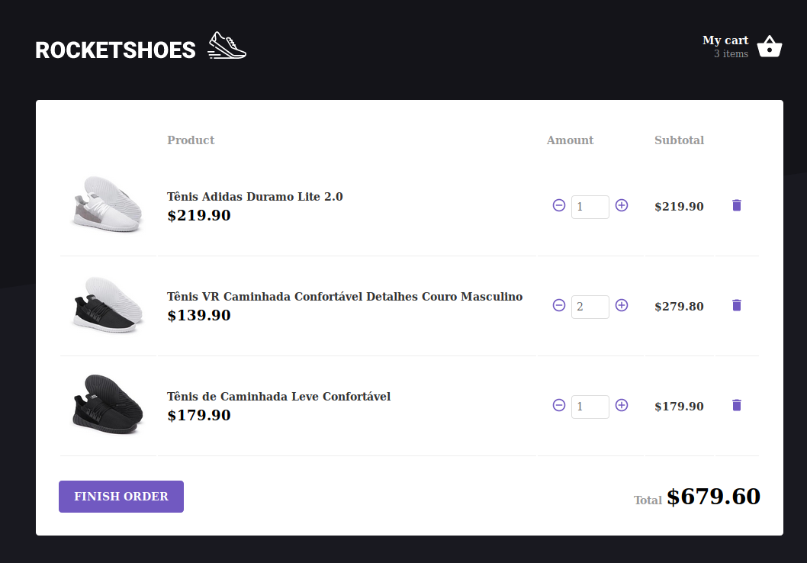

# Rocketshoes

<div style="display: flex;">
  <a href="http://artenesbok.com/rocketseat-bootcamp-rocketshoes/" style="margin-right: 10px;">
    
  </a>
  <a href="http://artenesbok.com/rocketseat-bootcamp-rocketshoes/">
    
  </a>
</div>

[Rocketseat's GoStack bootcamp](https://rocketseat.com.br/bootcamp) introductory module to Redux with ReactJS. [See it live here](http://artenesbok.com/rocketseat-bootcamp-rocketshoes/).

# About

A ReactJS app that uses `Redux` and `Redux Saga` to manage the state of a shopping cart in multiple components.

In this app you can:
- Browse items
- Add items to cart
- Change the amount of each item in the cart
- Remove items from cart

It was also configured to debug with [Reactotron](https://github.com/infinitered/reactotron). Everytime an action is dispatched either to the store or saga, it will log the data in Reactotron's desktop app.

# Set up

1. Clone the repository
```sh
git clone git@github.com:Artenes/rocketseat-bootcamp-rocketshoes.git
cd rocketseat-bootcamp-rocketshoes
```

2. Install dependencies
```sh
yarn
```

3. Install `json-server` globally, it serves fake data for the app.
```sh
yarn global add json-server
json-server src/server.json -p 3333
```

4. Run the app
```sh
yarn dev
```

5. Access [http://localhost:8080](http://localhost:8080).

# Contact

Artenes Nogueira - [artenes.nogueira@gmail.com](mailto:artenes.nogueira@gmail.com)

Linkedin - [linkedin.com/in/artenes/](https://www.linkedin.com/in/artenes/)

Blog - [artenesbok.com/](http://artenesbok.com/)
